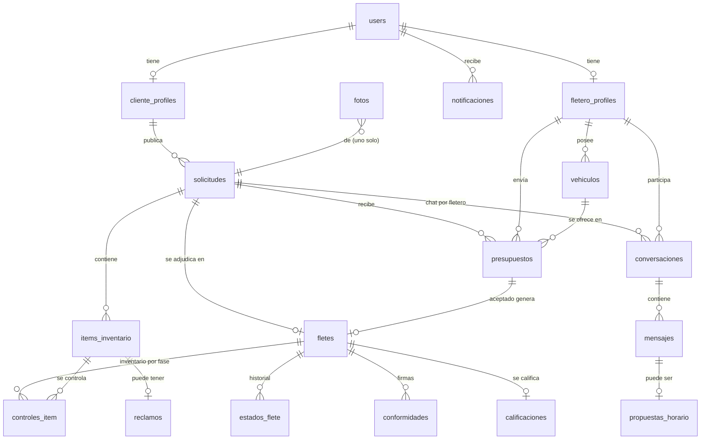
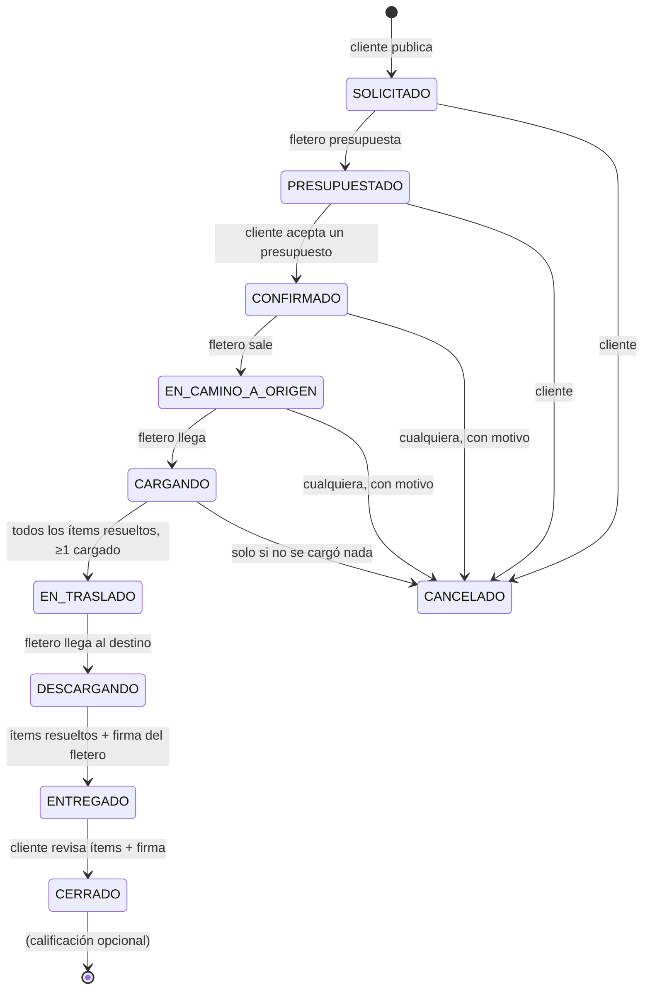

# Fletes Tucumán — Documento de arquitectura

Plataforma web que conecta a clientes que necesitan trasladar algo en el Gran Tucumán con
fleteros (moto, auto, camioneta o camión). El cliente publica qué quiere mover, los fleteros
cercanos le envían presupuestos, el cliente elige uno y el flete se sigue etapa por etapa con un
inventario digital hasta la entrega y la calificación.

Este documento describe la aplicación que está en `web/`. Todas las rutas de archivos son
relativas a esa carpeta.

---

## Índice

1. [Arquitectura general y patrón](#1-arquitectura-general-y-patrón)
2. [Árbol de carpetas](#2-árbol-de-carpetas)
3. [Modelo de base de datos](#3-modelo-de-base-de-datos)
4. [API: operaciones por módulo y eventos en tiempo real](#4-api-operaciones-por-módulo-y-eventos-en-tiempo-real)
5. [Autenticación, autorización por roles y validaciones](#5-autenticación-autorización-por-roles-y-validaciones)
6. [Imágenes y geolocalización](#6-imágenes-y-geolocalización)
7. [Convenciones](#7-convenciones)
8. [Testing, Git y despliegue](#8-testing-git-y-despliegue)
9. [Orden de desarrollo por sprints](#9-orden-de-desarrollo-por-sprints)

---

## Stack elegido y justificación

| Capa | Tecnología | Por qué |
|---|---|---|
| Frontend y backend | **Next.js 15** (App Router), **React 19**, **TypeScript** estricto | Un solo proyecto y un solo deploy. El servidor renderiza las páginas con datos ya autorizados, y las Server Actions eliminan la capa de API "a mano" entre formulario y base. TypeScript estricto detecta en compilación los errores de forma de datos. |
| Base de datos | **PostgreSQL + PostGIS** (en Supabase) | Datos relacionales con integridad fuerte (claves foráneas, `CHECK`, transacciones con bloqueo de filas). PostGIS resuelve la búsqueda por radio con índices espaciales en lugar de calcular distancias fila por fila. |
| ORM | **Prisma 6** | Esquema tipado, migraciones versionadas y cliente con tipos generados. Las consultas geográficas usan SQL parametrizado (`Prisma.sql`). |
| Autenticación | **NextAuth 4** (credenciales + JWT) + **bcrypt** | Sesión en cookie `httpOnly` firmada, sin estado en el servidor: funciona en serverless. |
| Validación | **Zod** + **react-hook-form** | El mismo schema valida el formulario en el navegador y la acción en el servidor. |
| Tiempo real | **Supabase Realtime** (broadcast + presence en canales privados) | Vercel no mantiene conexiones WebSocket propias (Socket.io no funciona en funciones serverless). Realtime es un servicio aparte, y el servidor publica por HTTP después de cada commit. |
| Imágenes | **Supabase Storage** (bucket público y privado) | El navegador sube directo con una URL firmada: el archivo nunca pasa por nuestro servidor. Las fotos privadas se sirven con URLs firmadas de corta duración. |
| Mapas | **Leaflet / React-Leaflet** + **OpenStreetMap** | Gratis y sin clave de API. |
| Geocodificación | **Photon** (komoot, datos OSM) | Admite autocompletar mientras se escribe y se puede limitar a la provincia. |
| UI | **Tailwind CSS** + componentes **shadcn/ui** (Radix) + **lucide-react** | Componentes accesibles que quedan dentro del repo y se pueden modificar. |
| PDF | **@react-pdf/renderer** | Comprobante del flete generado en el servidor. |
| Tests | **Vitest**, **PGlite + PostGIS**, **Playwright** + **axe** | Unitarios, integración con una base real y recorridos end-to-end con chequeo de accesibilidad. |
| Hosting | **Vercel** (app + cron) + **Supabase** (base, Realtime y Storage, región São Paulo) | Planes gratuitos suficientes para el proyecto, y deploy automático desde GitHub. |

---

## 1. Arquitectura general y patrón

### Patrón: monolito modular en capas, organizado por dominio

La aplicación es **un solo proyecto Next.js** que contiene el frontend y el backend. Por dentro
se separa en **capas** con reglas de dependencia estrictas, y el código de negocio se agrupa por
**módulo de dominio** (feature), no por tipo de archivo.

```
┌──────────────────────────────────────────────────────────────────────────┐
│  PRESENTACIÓN   src/app/ (rutas y páginas)  ·  src/components/ (UI)      │
│                 features/<módulo>/components/ (UI propia del módulo)     │
├──────────────────────────────────────────────────────────────────────────┤
│  APLICACIÓN     features/<módulo>/actions.ts   (escritura: Server Actions)│
│                 features/<módulo>/queries.ts   (lectura)                 │
│                 features/<módulo>/servicio.ts  (operaciones complejas)   │
│                 app/api/**/route.ts            (endpoints HTTP)          │
├──────────────────────────────────────────────────────────────────────────┤
│  DOMINIO        src/domain/  (lógica pura: ciclo del flete, precios,     │
│                 geo, compatibilidad de carga, roles, chat). Sin base de  │
│                 datos ni framework: ESLint lo prohíbe.                   │
├──────────────────────────────────────────────────────────────────────────┤
│  INFRAESTRUCTURA src/lib/  (Prisma, sesión, env, limitador de tasa,      │
│                 Supabase) · features/uploads · prisma/ (schema, SQL)     │
└──────────────────────────────────────────────────────────────────────────┘
```

**Reglas de dependencia**

- `domain/` no importa nada de `lib/`, `features/`, Prisma, Next ni NextAuth. Está forzado por
  ESLint (`eslint.config.mjs`, regla `no-restricted-imports`). Así la lógica central se prueba
  sin base de datos y la reutilizan el servidor, la UI y el PDF.
- Las páginas leen con `queries.ts` y escriben con `actions.ts`. Nunca usan Prisma directamente
  desde un componente cliente.
- Todo cambio de estado de un flete pasa por **una única puerta**: `features/fletes/servicio.ts`.

### Módulos de dominio

| Módulo | Responsabilidad |
|---|---|
| `auth` | Registro, login, cambiar y recuperar contraseña, rutas por rol |
| `clientes/perfil` | Datos del cliente y dirección habitual |
| `clientes/solicitudes` | Publicar, cancelar y ver solicitudes; fotos de la solicitud |
| `clientes/presupuestos` | Comparar y aceptar presupuestos |
| `clientes/fleteros` | Buscador de fleteros: cercanía, precio, calificación y precio estimado |
| `fleteros/perfil` | Onboarding, datos, vehículos, zona, tarifas, disponibilidad |
| `fleteros/solicitudes` | Feed de solicitudes cercanas y compatibles |
| `fleteros/presupuestos` | Enviar y retirar presupuestos |
| `fleteros/fletes` · `fleteros/metricas` | Agenda y ganancias del fletero |
| `fletes` | Ciclo del flete, inventario (controles por ítem), reclamos, calificación, comprobante PDF |
| `chat` | Conversaciones, mensajes, fotos, propuestas de horario, eventos del sistema |
| `notificaciones` | Avisos dentro de la app |
| `admin` | Usuarios, verificación de fleteros, resolución de reclamos |
| `mantenimiento` | Tareas diarias (cron) |
| `uploads` · `mapas` | Storage de fotos y geocodificación |

### Flujo de una escritura típica

```
Formulario (react-hook-form + Zod)
   └─▶ Server Action  createClienteAction / createFleteroAction / createAction
          1. lee la sesión desde la base (usuario activo, rol, perfil)
          2. valida el input con el mismo schema Zod
          3. handler: transacción Prisma
                 · bloquea la fila (SELECT … FOR UPDATE / FOR SHARE)
                 · revalida la regla con domain/ sobre datos bloqueados
                 · escribe + historial + mensaje de sistema en el chat + notificación
          4. commit → publica avisos en Supabase Realtime
          5. devuelve ActionResult { ok, data } | { ok:false, error, fieldErrors }
   └─▶ revalidatePath → la página se vuelve a renderizar en el servidor
```

---

## 2. Árbol de carpetas

En Next.js el frontend y el backend conviven. Abajo se indica a qué lado pertenece cada carpeta.

```
web/
├── prisma/                          BACKEND · base de datos
│   ├── schema.prisma                modelo de datos (fuente de verdad de tablas y relaciones)
│   ├── migrations/                  SQL versionado: tablas, PostGIS, CHECKs, índices GIST,
│   │                                políticas de Realtime y buckets de Storage
│   └── seed.ts                      datos de demo de Tucumán (BORRA la base)
│
├── src/
│   ├── app/                         FRONTEND · rutas (App Router). Cada carpeta es una URL
│   │   ├── page.tsx                 landing pública
│   │   ├── (auth)/login, registro,  formularios de acceso (grupo sin prefijo en la URL)
│   │   │   recuperar/[token]        recuperar la contraseña con el link del email
│   │   ├── panel/                   redirige al área del rol
│   │   ├── fleteros/[id]/           perfil público de un fletero
│   │   ├── cliente/                 ÁREA CLIENTE
│   │   │   ├── page.tsx             mis pedidos (con la barra de estado de cada uno)
│   │   │   ├── nuevo/               nuevo pedido en 5 pasos
│   │   │   ├── pedido/[id]/         detalle + presupuestos; con flete, seguimiento y recepción
│   │   │   │   └── calificar/       calificar al fletero (flete cerrado)
│   │   │   └── fleteros/            buscador (cercanía, precio, calificación)
│   │   ├── fletero/                 ÁREA FLETERO
│   │   │   ├── onboarding/[paso]/   alta guiada: datos, zona, vehículo, tarifas
│   │   │   └── (app)/               pedidos disponibles (page), pedido/[id] (ver y presupuestar
│   │   │                            o gestionar el flete), trabajos (agenda, presupuestos,
│   │   │                            ganancias), perfil (vehículos, zona, documentos, tarifas)
│   │   ├── (comun)/                 SECCIONES COMUNES con el marco de cada rol
│   │   │   ├── chat/[pedidoId]/     chat del pedido (el cliente elige fletero: /[fleteroId])
│   │   │   ├── notificaciones/      todos los avisos
│   │   │   └── perfil/              mi cuenta: datos, teléfono, contraseña
│   │   ├── admin/                   ÁREA ADMIN: fleteros (verificar documentación, cuentas) y
│   │   │                            reportes (denuncias y pedidos)
│   │   └── api/                     BACKEND · endpoints HTTP (route handlers)
│   │       ├── auth/[...nextauth]/  login/logout/sesión (NextAuth)
│   │       ├── chat/bandeja/        lista de conversaciones
│   │       ├── chat/[id]/mensajes/  historial paginado por cursor
│   │       ├── notificaciones/      avisos del usuario
│   │       ├── fletes/[id]/comprobante/  PDF del flete
│   │       └── cron/mantenimiento/  tarea diaria (Vercel Cron)
│   │
│   ├── components/                  FRONTEND · UI reutilizable
│   │   ├── ui/                      primitivas shadcn/ui (button, input, card, select…)
│   │   └── shared/                  componentes propios (app-shell, timeline de etapas,
│   │                                galería de fotos, estrellas, empty-state…)
│   │
│   ├── domain/                      DOMINIO · lógica pura + sus tests (*.test.ts)
│   │   ├── ciclo-flete.ts           etapas, transiciones, quién las mueve, inventario
│   │   ├── precio.ts                precio sugerido a partir de las tarifas
│   │   ├── compatibilidad.ts        ¿la carga entra en el vehículo? (kg y m³)
│   │   ├── carga.ts                 totales de peso y volumen del inventario
│   │   ├── geo.ts                   Haversine, región de servicio, aproximación de ubicación
│   │   ├── chat.ts                  estado de la conversación, ocultar contactos, sanitizar
│   │   ├── roles.ts                 roles, áreas y redirecciones seguras
│   │   └── catalogos.ts, fechas.ts, presupuesto.ts, agenda.ts, metricas.ts, patente.ts…
│   │
│   ├── features/<módulo>/           APLICACIÓN · un directorio por módulo de dominio
│   │   ├── schemas.ts               Zod: compartido entre formulario y servidor
│   │   ├── actions.ts               Server Actions (escrituras)            BACKEND
│   │   ├── queries.ts               lecturas para las páginas              BACKEND
│   │   ├── consultas-sql.ts         SQL parametrizado (PostGIS, agregados)  BACKEND
│   │   ├── servicio.ts              lógica transaccional compleja           BACKEND
│   │   ├── components/              UI propia del módulo                    FRONTEND
│   │   └── *.db.test.ts             tests de integración con base real
│   │
│   ├── lib/                         INFRAESTRUCTURA · servidor
│   │   ├── env.ts                   valida variables de entorno al arrancar (Zod)
│   │   ├── prisma.ts                cliente Prisma único
│   │   ├── auth.ts, session.ts      NextAuth, usuario actual, requireRol / requireFletero
│   │   ├── action.ts                createAction y variantes: sesión + rol + Zod + errores
│   │   ├── limite-tasa.ts           limitador de envíos (en Postgres, sin Redis)
│   │   ├── log.ts, request-id.ts    logs JSON con id de request
│   │   ├── correo.ts                emails con Resend (o consola/archivo sin clave)
│   │   ├── supabase.ts, jwt.ts      Realtime: publicar y firmar tokens por usuario
│   │   └── api.ts, formato.ts, geolocalizacion.ts, utils.ts
│   │
│   └── middleware.ts                id de request en todas las rutas y primera barrera por rol (Edge)
│
├── test/                            infraestructura de tests (PGlite, sesión simulada, servidor e2e)
├── e2e/                             recorridos Playwright (registro, flete, buscador, contraseñas, a11y…)
├── .env.example                     variables necesarias (ver sección 7)
└── DEPLOY.md                        guía de puesta en producción
```

---

## 3. Modelo de base de datos

PostgreSQL con PostGIS. Las tablas se definen en `prisma/schema.prisma`, y lo que Prisma no
puede expresar (columnas geográficas generadas, índices GIST, `CHECK`, políticas) está en las
migraciones SQL.

### Diagrama entidad-relación (simplificado)



`fotos` pertenece a **exactamente uno** de: solicitud, ítem, vehículo, mensaje, control o
reclamo (lo garantiza un `CHECK num_nonnulls(...) = 1`).

### Tablas

| Tabla | Propósito | Campos clave |
|---|---|---|
| `users` | Cuenta y rol | `email` único, `passwordHash`, `rol` (CLIENTE/FLETERO/ADMIN), `activo`, `credencialesCambiadasEn` (invalida sesiones anteriores) |
| `cliente_profiles` | Perfil del cliente | `userId` único, dirección habitual (lat/lng): punto por defecto del buscador |
| `tokens_recuperacion` | Recuperar contraseña | `tokenHash` (SHA-256, único), `expiraEn` (30 min), `usadoEn` (un solo uso) |
| `fletero_profiles` | Perfil, zona y tarifas del fletero | `baseLat/baseLng` → **`baseGeo`** (geography), `radioCoberturaKm` (1–100), `precioMinimo/PorKm/PorM3/PorAyudante`, `disponible`, `verificado`, `onboardingCompletadoEn`, `ratingPromedio` y `cantidadCalificaciones` (desnormalizados) |
| `vehiculos` | Vehículos del fletero | `tipo`, `patente` única, `capacidadKg`, `volumenM3`, `activo` |
| `solicitudes` | Pedido de flete | origen y destino (lat/lng, piso, ascensor), **`origenGeo`**, `distanciaKm`, `pesoTotalKg`, `volumenTotalM3`, `fecha`, `franja`, `ayudantesRequeridos`, `estado` (ABIERTA/ADJUDICADA/CANCELADA/VENCIDA) |
| `items_inventario` | Objetos a trasladar | `nombre`, `cantidad`, medidas, peso, `fragil`, `estadoInicial` |
| `presupuestos` | Oferta de un fletero | `monto`, `montoSugerido`, `vehiculoId`, `validoHasta`, `estado`; **único (solicitudId, fleteroId)** |
| `fletes` | Servicio adjudicado | `solicitudId` y `presupuestoId` únicos, `precioAcordado`, **`etapa`**, `recepcionConfirmadaEn` |
| `estados_flete` | Historial auditable de etapas | `etapa`, `autorId`, `nota`, ubicación opcional del fletero |
| `controles_item` | Inventario digital | `fase` (CARGA/DESCARGA/RECEPCION) × `resultado`; **único (itemId, fase)** |
| `reclamos` | Reclamo del cliente por un ítem | `descripcion`, `estado`, `resolucion` del admin |
| `conformidades` | Firma de entrega y de recepción | texto exacto aceptado, con los números del inventario; único (fleteId, rol) |
| `calificaciones` | Reseña | `puntaje` 1–5; **única por flete** |
| `conversaciones` | Chat cliente ↔ fletero por solicitud | único (solicitudId, fleteroId), marcas de lectura |
| `mensajes` | Mensajes | `tipo` (TEXTO/IMAGEN/SISTEMA/PROPUESTA), `clientId` para idempotencia |
| `propuestas_horario` | Propuesta de fecha desde el chat | `fecha`, `franja`, `estado` |
| `notificaciones` | Avisos en la app | `clave` para agrupar o no duplicar |
| `fotos` | Metadatos de imágenes | `ruta` en el bucket, dimensiones, dueño único |
| `subidas_pendientes` | Subidas firmadas sin adjuntar | se limpian a diario |
| `limites_tasa` | Contadores del limitador | (clave, ventana) |

### Índices geográficos y de rendimiento

```sql
-- Columnas generadas: se derivan de lat/lng y nunca se escriben a mano
"baseGeo"   geography(Point,4326) GENERATED ALWAYS AS (ST_SetSRID(ST_MakePoint("baseLng","baseLat"),4326)::geography) STORED
"origenGeo" geography(Point,4326) GENERATED ALWAYS AS (ST_SetSRID(ST_MakePoint("origenLng","origenLat"),4326)::geography) STORED

CREATE INDEX "fletero_profiles_baseGeo_gix" ON fletero_profiles USING GIST ("baseGeo");
CREATE INDEX "solicitudes_origenGeo_gix"   ON solicitudes      USING GIST ("origenGeo");
```

Se usa `geography` (no `geometry`) porque las distancias salen directamente en **metros
sobre el elipsoide**, sin proyecciones.

Otros índices compuestos según las consultas reales: `solicitudes(estado, fecha)`,
`presupuestos(solicitudId, estado)`, `fletes(fleteroId, etapa)`,
`mensajes(conversacionId, createdAt DESC, id)` (paginación por cursor),
`fletero_profiles(disponible, ratingPromedio)`.

### Integridad en la base (no solo en el código)

- `CHECK` de rangos: radio 1–100 km, tarifas ≥ 0, puntaje 1–5, cantidades > 0, montos > 0.
- `CHECK control_resultado_de_su_fase`: cada fase admite solo sus resultados.
- `CHECK foto_un_solo_duenio`.
- Únicos que evitan duplicados: un presupuesto por fletero y solicitud, un flete por solicitud,
  una calificación por flete, un control por ítem y fase.
- **RLS activado sin políticas** en todas las tablas: la API REST pública de Supabase no puede
  leer ni escribir nada. Solo accede el servidor, vía Prisma.

---

## 4. API: operaciones por módulo y eventos en tiempo real

### Decisión de diseño: Server Actions en lugar de una API REST tradicional

Las escrituras se exponen como **Server Actions** de Next.js: funciones del servidor que el
formulario llama directamente. Por debajo, Next las invoca con un `POST` HTTP al servidor. Se
eligieron porque:

- comparten tipos y schemas Zod con el formulario, sin duplicar contratos;
- la autorización se aplica de forma uniforme con `createAction` (sesión + rol + validación);
- no hace falta mantener ni documentar un cliente HTTP aparte.

Las **lecturas** se hacen en el servidor al renderizar la página (`queries.ts`). Solo se
expusieron como endpoints HTTP las lecturas que el navegador necesita pedir por su cuenta
(chat, notificaciones, PDF) y el cron.

Para documentarlas, la tabla incluye el **equivalente REST** de cada operación.

### Endpoints HTTP (route handlers)

| Método | Ruta | Quién | Descripción |
|---|---|---|---|
| POST | `/api/auth/callback/credentials` | público | Login (NextAuth). Límite: 10 intentos cada 15 min por email |
| GET | `/api/auth/session` · POST `/api/auth/signout` | autenticado | Sesión actual / cerrar sesión |
| GET | `/api/chat/bandeja` | cliente, fletero | Conversaciones con último mensaje y no leídos |
| GET | `/api/chat/:id/mensajes?antes=<cursor>` | participantes | Página anterior del historial (scroll infinito) |
| GET | `/api/chat/:id/mensajes?despues=<cursor>` | participantes | Mensajes nuevos + estado de la conversación (reconexión o sondeo) |
| GET | `/api/notificaciones` | autenticado | Avisos del usuario |
| GET | `/api/fletes/:id/comprobante` | participantes | Comprobante PDF del flete |
| GET | `/api/cron/mantenimiento` | Vercel Cron (`Bearer CRON_SECRET`) | Vence solicitudes, avisa fletes demorados, borra fotos abandonadas y tokens de recuperación viejos |
| GET | `/cliente/fleteros?ref&solicitud&lat&lng&dir&radio&vehiculo&precioMax&rating&orden&todos` | cliente | Buscador (página con formulario GET: los filtros quedan en la URL) |

Todas las respuestas JSON llevan `Cache-Control: private, no-store`, y toda respuesta lleva el
header `x-request-id` (ver sección 7, *Logs*).

### Operaciones por módulo (Server Actions)

**Auth**

| Acción | Equivalente REST | Rol |
|---|---|---|
| `registrarUsuario` | `POST /auth/register` | público (máx. 5 registros por hora por IP) |
| `cambiarContrasena` | `PUT /me/contrasena` (exige la actual; máx. 5 intentos cada 15 min) | autenticado |
| `solicitarRecuperacion` | `POST /auth/recuperar` (misma respuesta exista o no la cuenta) | público (10/h por IP, 3/h por email) |
| `restablecerContrasena` | `POST /auth/recuperar/:token` | público, con token de un solo uso |

**Cliente — perfil** (`features/clientes/perfil/actions.ts`)

| Acción | Equivalente REST |
|---|---|
| `guardarDatosCliente` | `PUT /clientes/me` |
| `guardarDireccionHabitual` | `PUT /clientes/me/direccion` |

**Fletero — perfil** (`features/fleteros/perfil/actions.ts`)

| Acción | Equivalente REST |
|---|---|
| `guardarDatos` | `PUT /fleteros/me` |
| `guardarZona` | `PUT /fleteros/me/zona` |
| `guardarTarifas` | `PUT /fleteros/me/tarifas` |
| `guardarDisponibilidad` | `PATCH /fleteros/me/disponibilidad` |
| `crearVehiculo` · `actualizarVehiculo` · `cambiarEstadoVehiculo` | `POST/PUT/PATCH /fleteros/me/vehiculos/:id` |
| `firmarSubidaFotoVehiculo` · `agregarFotoVehiculo` · `eliminarFotoVehiculo` | `POST/DELETE /vehiculos/:id/fotos` |

**Cliente — solicitudes y presupuestos**

| Acción | Equivalente REST | Rol |
|---|---|---|
| `crearSolicitud` | `POST /solicitudes` (máx. 10 por día) | cliente |
| `cancelarSolicitud` | `POST /solicitudes/:id/cancelar` | cliente dueño |
| `prepararFotoSolicitud` · `agregarFotoSolicitud` · `quitarFotoSolicitud` | `POST/DELETE /solicitudes/:id/fotos` | cliente dueño |
| `aceptarPresupuesto` | `POST /presupuestos/:id/aceptar` → crea el flete | cliente dueño |

**Fletero — presupuestos**

| Acción | Equivalente REST |
|---|---|
| `enviarPresupuesto` | `POST /solicitudes/:id/presupuestos` (recalcula acceso por radio, compatibilidad del vehículo, precio sugerido y vencimiento) |
| `retirarPresupuesto` | `POST /presupuestos/:id/retirar` |

**Fletes — ciclo, inventario y calificación** (`features/fletes/actions.ts` → `servicio.ts`)

| Acción | Equivalente REST | Rol |
|---|---|---|
| `avanzarEtapa` | `PATCH /fletes/:id/etapa` (con ubicación opcional y firma de conformidad) | según la etapa |
| `cancelarFlete` | `POST /fletes/:id/cancelar` (motivo obligatorio) | cliente o fletero |
| `registrarControl` | `PUT /fletes/:id/items/:itemId/controles/:fase` (resultado, observación, foto) | fletero (carga/descarga), cliente (recepción) |
| `marcarTodos` | `POST /fletes/:id/controles/:fase/todos` | ídem |
| `quitarControl` | `DELETE /fletes/:id/items/:itemId/controles/:fase` | ídem |
| `prepararFotoFlete` | `POST /fletes/:id/fotos/firmar` | participantes |
| `calificarFlete` | `POST /fletes/:id/calificacion` | cliente, flete CERRADO |

**Chat**

| Acción | Equivalente REST |
|---|---|
| `enviarMensaje` | `POST /conversaciones/:id/mensajes` (máx. 20/min por conversación y 200/h por usuario) |
| `prepararFotoChat` · `enviarFotoChat` | `POST /conversaciones/:id/fotos` (máx. 10 cada 10 min) |
| `marcarLeido` | `POST /conversaciones/:id/leido` |
| `proponerHorario` · `responderPropuesta` | `POST /conversaciones/:id/propuestas`, `PATCH /propuestas/:id` |
| `obtenerTokenRealtime` | `POST /realtime/token` |

**Notificaciones y admin**

| Acción | Equivalente REST | Rol |
|---|---|---|
| `marcarNotificacionesLeidas` | `POST /notificaciones/leidas` | autenticado |
| `cambiarEstadoUsuario` | `PATCH /admin/usuarios/:id` | admin |
| `verificarFletero` | `PATCH /admin/fleteros/:id/verificacion` | admin |
| `resolverReclamo` | `PATCH /admin/reclamos/:id` | admin |

**Formato de respuesta de toda acción**

```ts
{ ok: true,  data: T }
{ ok: false, error: "mensaje para el usuario", fieldErrors?: { campo: ["…"] } }
```

### Eventos en tiempo real (Supabase Realtime)

Hay tres tipos de canal **privados**. El servidor firma un JWT de 15 minutos con la lista de
canales (`topics`) que el usuario puede usar, y una política RLS sobre `realtime.messages` solo
deja suscribirse a esos canales.

| Canal | Evento | Emisor | Payload | Uso |
|---|---|---|---|---|
| `conversacion:{id}` | `mensaje.creado` | servidor | `{ mensaje }` | Mensaje nuevo (texto, foto, sistema o propuesta) |
| | `mensajes.leidos` | servidor | `{ rol, hasta }` | Doble check de lectura |
| | `propuesta.actualizada` | servidor | `{ propuestaId, estado }` | Fecha propuesta aceptada o rechazada |
| | `escribiendo` | navegador | `{ rol }` | Indicador "escribiendo…" |
| | *presence* `sync` | navegador | — | Indicador "en línea" |
| `usuario:{id}` | `bandeja.actualizada` | servidor | `{ conversacionId }` | Refrescar la bandeja y los no leídos |
| | `notificacion.creada` | servidor | `{}` | Refrescar la campanita |
| `flete:{id}` | `flete.actualizado` | servidor | `{ motivo: "etapa" \| "inventario" \| "reclamo" }` | El cliente ve la etapa, el mapa y el inventario actualizarse solos |

- El servidor publica **después del commit** (`conEventos` en `features/chat/eventos.ts`): nunca
  se avisa algo que después se revierte.
- Los navegadores solo pueden **emitir** en canales `conversacion:*` y solo eventos efímeros
  (escribiendo, presencia). Los mensajes siempre se guardan pasando por el servidor.
- **Degradación**: si Realtime no está configurado o se cae, el chat sigue funcionando con
  consultas periódicas a `/api/chat/:id/mensajes?despues=…`.
- **Idempotencia**: cada mensaje lleva un `clientId` generado por el navegador, con índice único
  `(autorId, clientId)`. Un reintento no duplica el mensaje.

---

## 5. Autenticación, autorización por roles y validaciones

### Autenticación

- **NextAuth** con proveedor de credenciales y sesión **JWT en cookie `httpOnly`** (7 días).
- Contraseñas con **bcrypt, costo 12**. Si el email no existe, se compara igual contra un hash
  simulado, para que el tiempo de respuesta no revele qué emails están registrados.
- **Límite de intentos**: 10 por email cada 15 minutos.
- Política de contraseña: 8 a 72 caracteres (el límite de bcrypt), con al menos una letra y un número.
- El rol `ADMIN` no se puede elegir al registrarse.
- **Cerrar sesiones al cambiar la contraseña**: el JWT no tiene estado, así que el token guarda
  cuándo se inició sesión (`autenticadoEn`) y el usuario, cuándo cambió sus credenciales
  (`credencialesCambiadasEn`). `getUsuarioActual` rechaza los tokens anteriores al cambio
  (`domain/sesion.ts`): cambiar o recuperar la contraseña cierra la sesión en todos los dispositivos.
- **Recuperar contraseña**: link por email (Resend) con un token aleatorio de 256 bits, de un solo
  uso y válido 30 minutos. En la base se guarda solo su SHA-256; un link nuevo anula los anteriores
  y el token se marca usado dentro de la misma transacción que cambia la contraseña. El link se arma
  con `NEXTAUTH_URL` (nunca con el header `Host`, que controla quien hace el pedido) y la página no
  envía *referrer*.

### Autorización en tres capas

1. **Middleware (Edge)**: corre en todas las rutas para asignar el id de request; en
   `/cliente/*`, `/fletero/*`, `/admin/*` y las secciones comunes (`/chat`, `/notificaciones`,
   `/perfil`) además exige sesión (si no hay, redirige a `/login`) y manda a cada rol a su propia
   área. Las rutas anteriores (`/cliente/solicitudes`, `/fletero/agenda`, `/cliente/mensajes/:id`…)
   redirigen a las nuevas (`next.config.ts` y páginas de redirección por id).
2. **Página o layout**: `requireRol(...)`, `requireCliente()` y `requireFletero()` vuelven a leer
   el usuario **desde la base**. Si un admin lo desactiva, le cambia el rol o el usuario cambió su
   contraseña, aplica en el siguiente request, aunque el JWT siga vigente.
3. **Acción**: `createAction({ roles })`, `createClienteAction` y `createFleteroAction` exigen
   sesión y rol, e inyectan el `clienteId` o `fleteroId`. **Toda consulta filtra por ese id**
   (por ejemplo `where: { id, solicitud: { clienteId } }`), así que no se puede operar sobre
   recursos ajenos. El fletero además necesita el onboarding completo.

La matriz completa está probada en `src/lib/autorizacion.db.test.ts`: cada Server Action sin
sesión, con cada rol prohibido y sobre recursos ajenos. Una acción nueva que no se agregue ahí
hace fallar la suite.

**Reglas de negocio de acceso**

| Recurso | Quién lo ve |
|---|---|
| Solicitud abierta | Su cliente, y los fleteros cuyo radio la cubre (con la **dirección aproximada** a ~330 m) |
| Solicitud adjudicada | Su cliente, el fletero adjudicado y los que presupuestaron |
| Chat | Solo el cliente y ese fletero. Se habilita cuando el fletero presupuesta |
| Datos de contacto en el chat | **Ocultos** (teléfonos, emails, WhatsApp) hasta que hay flete confirmado |
| Perfil público del fletero | Cualquiera, sin dirección exacta ni datos de contacto |

### Ciclo del flete y validación de transiciones

El enunciado define 7 estados. La implementación usa **9 etapas** más detalladas, que se
corresponden así:

| Estado del enunciado | Etapa(s) implementada(s) | Dónde vive |
|---|---|---|
| publicado | `SOLICITADO` | Derivada: solicitud ABIERTA sin presupuestos |
| presupuestado | `PRESUPUESTADO` | Derivada: solicitud ABIERTA con presupuestos pendientes |
| confirmado | `CONFIRMADO` → `EN_CAMINO_A_ORIGEN` | `fletes.etapa` |
| cargado | `CARGANDO` (termina con todos los ítems controlados) | `fletes.etapa` + `controles_item` (fase CARGA) |
| en traslado | `EN_TRASLADO` | `fletes.etapa` |
| entregado | `DESCARGANDO` → `ENTREGADO` (firma del fletero) | `fletes.etapa` + `controles_item` (DESCARGA) + `conformidades` |
| calificado | `CERRADO` (firma del cliente) + `calificaciones` | `fletes.etapa` + tabla `calificaciones` |
| *(cancelado)* | `CANCELADO` | `fletes.etapa` / `solicitudes.estado` |

**Por qué más etapas**

- **`EN_CAMINO_A_ORIGEN` y `CARGANDO` por separado**: el cliente sabe cuándo el fletero salió y
  cuándo llegó. Además, el flete se puede cancelar mientras no se haya cargado nada.
- **`CARGANDO` en lugar de "cargado"**: "cargado" es el *resultado* de esa etapa. No se puede
  pasar a `EN_TRASLADO` sin resolver cada ítem (cargado o no cargado con motivo).
- **`DESCARGANDO` y `ENTREGADO`**: separan el control de descarga del fletero (entregado, con daño
  o faltante) de la revisión del cliente (conforme o reclamo).
- **"Calificado" no es un estado**: la calificación es opcional y única por flete. Si fuera un
  estado obligatorio, un flete quedaría "abierto" para siempre cuando el cliente no califica. Por
  eso el flete termina en `CERRADO` (el cliente confirmó la recepción) y la calificación queda
  como un registro aparte que solo se habilita en ese estado.



Las reglas (quién mueve cada transición y con qué condición) están en **una sola tabla** en
`domain/ciclo-flete.ts`. La usan el servidor para validar, la UI para mostrar el botón correcto y
el PDF. El servidor **bloquea la fila del flete** (`SELECT … FOR UPDATE`) y vuelve a validar
con los datos bloqueados: dos clics simultáneos no pueden saltear una regla.

### Validaciones

| Nivel | Cómo |
|---|---|
| Formulario | `react-hook-form` + `zodResolver` con el mismo schema que el servidor |
| Servidor | `createAction` vuelve a validar todo input con Zod. **Nunca se confía en valores calculados por el navegador**: precio sugerido, distancia, totales de carga, acceso por radio y vencimiento se recalculan |
| Dominio | Reglas de negocio puras (`validarTransicion`, `validarControl`, `evaluarCompatibilidad`) |
| Base de datos | `CHECK`, únicos, claves foráneas y tipos `enum` |
| Concurrencia | Transacciones con `FOR UPDATE` / `FOR SHARE`: por ejemplo, dos aceptaciones simultáneas no pueden crear dos fletes |
| Abuso | Limitador por ventana fija en Postgres (`limites_tasa`): funciona con varias instancias serverless sin Redis |
| Entrada de URL | Filtros y `callbackUrl` se validan contra catálogos (`destinoSeguro` evita *open redirects*) |
| Texto del chat | `sanitizarTexto` (normaliza y quita caracteres invisibles). Se guarda como texto plano y React lo escapa al mostrarlo |

---

## 6. Imágenes y geolocalización

### Imágenes

```
Navegador                        Servidor (Server Action)            Supabase Storage
   │ 1. elige foto                    │                                    │
   │ 2. comprime: máx 1600 px, JPEG   │                                    │
   │    0.82 (~4 MB → ~300 KB)        │                                    │
   │ 3. pedir subida ────────────────▶│ verifica rol y dueño del recurso   │
   │                                  │ crea ruta <carpeta>/<uuid>.jpg     │
   │                                  │ createSignedUploadUrl ────────────▶│
   │                                  │ registra subidas_pendientes        │
   │◀──────────────── token + ruta ───│                                    │
   │ 4. sube el archivo directo ──────────────────────────────────────────▶│
   │ 5. confirmar (ruta) ────────────▶│ valida formato, carpeta y que el   │
   │                                  │ archivo exista ───────────────────▶│
   │                                  │ crea fila en `fotos`               │
```

- **Dos buckets**: `fotos-publicas` (vehículos, para el perfil público) y `fotos-privadas`
  (solicitudes, ítems, chat, controles y reclamos), que se sirven con **URLs firmadas de 6 h**.
- El bucket limita **tipo (solo `image/jpeg`) y tamaño (5 MB)**: una URL firmada de subida no lo
  hace por sí sola.
- La base guarda solo la **ruta**, no la URL: la URL se arma o se firma al mostrarla.
- El **cron diario** borra los archivos de subidas que nunca se adjuntaron.
- Las fotos de **inventario** quedan asociadas al control (carga o descarga) o al reclamo: son la
  evidencia del estado de cada objeto en cada fase.
- Límite de fotos de chat por usuario: 10 cada 10 minutos.

### Geolocalización

- **Ingreso de direcciones**: autocompletado con Photon, limitado a la provincia de Tucumán
  (`REGION_SERVICIO`). El usuario puede ajustar el pin en el mapa (geocodificación inversa).
- **Almacenamiento**: lat/lng en columnas `float` + columna `geography` **generada** con índice GIST.
- **Cercanía (feed del fletero)**: en SQL con PostGIS, sobre el índice espacial.

  ```sql
  WHERE s.estado = 'ABIERTA' AND s.fecha >= hoy
    AND ST_DWithin(s."origenGeo", f."baseGeo", f."radioCoberturaKm" * 1000)   -- filtra por radio
    AND EXISTS (vehículo activo con capacidadKg >= peso y volumenM3 >= volumen)
  ORDER BY ST_Distance(s."origenGeo", f."baseGeo")                           -- ordena por cercanía
  ```

  `ST_DWithin` sobre `geography` usa el índice GIST y trabaja en metros. El acceso al detalle y
  al envío de presupuestos vuelve a verificar el radio en el servidor.
- **Cercanía (buscador del cliente)**: `features/clientes/fleteros/consultas-sql.ts`. El punto de
  referencia es la **dirección habitual** (por defecto), el **origen de una solicitud abierta
  propia** o una **dirección escrita** en el momento (validada dentro de la región).

  ```sql
  WHERE onboarding completo AND usuario activo [AND disponible]
    AND EXISTS (vehículo activo [del tipo pedido] [donde entra la carga de la solicitud])
    [AND "precioMinimo" <= tope] [AND rating >= mínimo]
    AND ST_DWithin("baseGeo", punto, "radioCoberturaKm" * 1000)   -- "que lleguen a ese punto"
        -- o ST_DWithin("baseGeo", punto, km * 1000)               -- "hasta N km"
  ORDER BY ST_Distance("baseGeo", punto) | precio estimado | rating | reseñas
  ```

  Con una solicitud de referencia se muestra el **precio estimado** de cada fletero (calculado
  con `domain/precio`) y se puede ordenar por él. En SQL se ordena con la misma fórmula sin el
  redondeo, y un test verifica que el orden coincide con el del dominio. Si la solicitud no es del
  cliente o no está abierta, se ignora: no revela el origen ni la carga de solicitudes ajenas.
- **Distancia del trayecto**: Haversine (`domain/geo.ts`) entre origen y destino, calculada en el
  servidor al guardar. Para el **precio sugerido** se multiplica por **1,3** (factor de recorrido
  urbano estimado para el Gran Tucumán).
- **Precio sugerido** = `max(mínimo, km_ruta × $/km + m³ × $/m³) + ayudantes × $/ayudante`,
  redondeado a $100. Es una sugerencia que el fletero puede editar. Se guarda `montoSugerido`
  para medir cuánto lo ajustan.
- **Privacidad**: antes de adjudicar, el fletero ve una **ubicación aproximada** (grilla de
  ~330 m) y la dirección sin número.
- **Seguimiento**: al cambiar de etapa, el navegador del fletero puede compartir su ubicación
  (opcional, con precisión). Se guarda en `estados_flete` y el cliente la ve en el mapa del flete.

---

## 7. Convenciones

### Nombres

| Elemento | Convención | Ejemplo |
|---|---|---|
| Idioma del dominio | Español (como el negocio) | `solicitud`, `presupuesto`, `fletero` |
| Archivos | `kebab-case` | `form-solicitud.tsx`, `ciclo-flete.ts` |
| Componentes | `PascalCase` | `PresupuestosRecibidos` |
| Funciones y variables | `camelCase`, verbo para acciones | `aceptarPresupuesto`, `buscarFleteros` |
| Constantes | `UPPER_SNAKE_CASE` | `LARGO_MINIMO_MOTIVO`, `FACTOR_RUTA_URBANA` |
| Modelos Prisma | `PascalCase` singular → tabla `snake_case` plural (`@@map`) | `ItemInventario` → `items_inventario` |
| Enums | `UPPER_SNAKE_CASE` | `EN_TRASLADO`, `PAQUETERIA` |
| Tests | `*.test.ts` (unitario), `*.db.test.ts` (base), `*.integration.test.ts`, `e2e/*.spec.ts` |
| Eventos Realtime | `entidad.accion` | `mensaje.creado`, `flete.actualizado` |
| Canales Realtime | `tipo:id` | `conversacion:abc`, `usuario:xyz` |

### Variables de entorno

Se validan **al arrancar** con Zod (`src/lib/env.ts`). Si falta una o tiene formato inválido, la
app no levanta y muestra un mensaje claro.

| Variable | Obligatoria | Uso |
|---|---|---|
| `DATABASE_URL` | sí | Postgres vía pooler (puerto 6543, `pgbouncer=true&connection_limit=1`) |
| `DIRECT_URL` | sí | Conexión directa (5432) para migraciones |
| `NEXTAUTH_URL` | sí | URL pública de la app |
| `NEXTAUTH_SECRET` | sí (≥ 32 caracteres) | Firma de la sesión |
| `SUPABASE_URL`, `SUPABASE_ANON_KEY`, `SUPABASE_SERVICE_ROLE_KEY`, `SUPABASE_JWT_SECRET` | las cuatro o ninguna | Realtime y Storage. Sin ellas, chat por sondeo y sin fotos |
| `CRON_SECRET` | para el cron (≥ 16) | Autoriza `/api/cron/mantenimiento` |
| `RESEND_API_KEY` | no | Emails de recuperar contraseña. Sin ella: en desarrollo el link sale por consola; en producción no se envía (y el link nunca se escribe en los logs) |
| `CORREO_REMITENTE` | no | Remitente con dominio verificado en Resend (sin él, Resend solo entrega a la cuenta dueña) |
| `CORREO_ARCHIVO` | solo tests | Los e2e guardan los emails en un archivo para leer el link |

`.env` nunca se versiona. `.env.example` documenta cada variable. La `service_role` key y los
secretos **solo existen en el servidor**: al navegador llegan únicamente la URL y la anon key de
Supabase, y un token de Realtime por usuario.

### Manejo de errores

| Tipo | Tratamiento |
|---|---|
| Validación (Zod) | `{ ok:false, error:"Revisá los datos marcados.", fieldErrors }`: el formulario marca cada campo |
| Negocio esperado | `throw new ActionError("mensaje")`: el mensaje llega tal cual al usuario |
| Único violado (Prisma `P2002`) | Mensaje amigable ("Ya existe un registro con esos datos" o uno específico) |
| Inesperado | Se registra como `action.error_inesperado` (con el id del request) y el usuario ve un mensaje genérico. Nunca se exponen detalles internos |
| Route handlers | JSON `{ error }` con status `401` o `404` (`lib/api.ts`) |
| Páginas | `redirect` si no hay sesión o el rol no corresponde. Cada área (cliente, fletero y admin) tiene su `error.tsx` (`ErrorSeccion`): se muestra dentro del layout, ofrece reintentar o volver al inicio, y muestra el *digest* de Next para encontrar el error en los logs |
| Servicios externos (Realtime, Storage, Resend) | Un fallo **no rompe** la operación: queda registrado y el dato ya está en la base |

### Logs

- **JSON, una línea por evento** (`src/lib/log.ts`):
  `{"nivel":"warn","evento":"cron.no_autorizado","momento":"2026-10-07T19:23:03.071Z","requestId":"…"}`.
  Nombres de evento `subsistema.suceso`: `action.error_inesperado`, `cron.mantenimiento`,
  `realtime.publicar_fallo`, `storage.borrar_fallo`, `correo.enviado`, `auth.login_bloqueado`…
- **Id de request**: el middleware asigna `x-request-id` a cada request (reusa uno entrante solo si
  tiene un formato seguro, para que nadie inyecte texto en los logs), lo pasa al servidor y lo
  devuelve en la respuesta. `logDelRequest()` lo agrega a cada línea.
- Vercel recolecta la salida por deploy y función (*Runtime Logs*), y ahí se filtra por `evento`
  o `requestId`.
- **Nunca** se registran contraseñas, tokens, hashes, secretos ni contenido de mensajes: el logger
  oculta esas claves en cualquier nivel de anidamiento. Tampoco se registran emails.

### Estilo de código

TypeScript `strict` + `noUncheckedIndexedAccess` + `exactOptionalPropertyTypes`, ESLint
(`next/core-web-vitals`, `consistent-type-imports`) y Prettier con el plugin de Tailwind.

---

## 8. Testing, Git y despliegue

### Estrategia de testing

| Nivel | Herramienta | Qué cubre | Comando |
|---|---|---|---|
| Unitario | Vitest | `domain/` completo (ciclo del flete, precio, geo, compatibilidad, chat, fechas, roles, sesión), SQL del feed y del buscador contra PGlite + PostGIS, parámetros de URL, logger y componentes de UI | `npx vitest run --project unit` |
| Integración | Vitest + **PGlite + PostGIS** (o Postgres real con `TEST_DATABASE_URL`) | Server Actions contra una base con todas las migraciones: auth (registro, login, cambio y recuperación de contraseña), perfiles, buscador, solicitudes, presupuestos, **concurrencia de aceptación**, fletes, chat, admin, mantenimiento, correo, **matriz de autorización** | `npx vitest run --project db` |
| End-to-end | Playwright + axe | Ciclo completo de un flete con dos navegadores, buscador, cambio y recuperación de contraseña (con el link del email), registro, acceso por rol, `x-request-id` y **accesibilidad WCAG 2.1 AA**, en escritorio y móvil (Pixel 7) | `npm run test:e2e` |

Estado al cierre del sprint 8: **394 unitarios, 241 de integración (30 solo corren con Postgres
real, en CI) y 116 e2e en verde**.
| Estático | `tsc`, ESLint | Tipos y reglas de capas | `npm run typecheck` · `npm run lint` |

### Integración continua (`.github/workflows/web.yml`)

Se ejecuta en cada PR y cada push a `main` que toque `web/`:

1. **calidad**: lint + typecheck + unitarios.
2. **integracion**: tests de base contra un servicio `postgis/postgis:16-3.4` real (así también
   corren los tests de concurrencia, que PGlite no reproduce).
3. **e2e**: build de producción + Playwright. Si falla, sube el reporte como artefacto.

### Git

- **Ramas**: `main` es siempre desplegable. Se trabaja en `feature/<tema>`,
  `fix/<tema>` o `docs/<tema>`, y se integra **por Pull Request con el CI en verde**.
- **Commits**: en español, en imperativo y describiendo el cambio. Se recomienda
  *Conventional Commits*:
  `feat(chat): propuestas de horario`, `fix(fletes): bloquear fila al cancelar`,
  `docs: arquitectura`, `test(presupuestos): concurrencia de aceptación`.
  Evitar mensajes como "done" o "todo resuelto": no dicen qué cambió.
- **Migraciones**: nunca se edita una migración ya aplicada en producción. Se crea una nueva con
  `npm run db:migrate`.

### Despliegue

Detalle paso a paso en `web/DEPLOY.md`. En resumen:

1. **Supabase** (región São Paulo): activar PostGIS, desactivar el acceso público a Realtime y
   anotar las credenciales.
2. **Migraciones**: `npm run db:deploy` (crea tablas, índices GIST, CHECKs, políticas de Realtime
   y buckets). **No** correr el seed en producción.
3. **Vercel**: proyecto con Root Directory en la raíz del repo (el `vercel.json` de la raíz compila `web/`)
   y las variables de entorno de la sección 7.
   Cada push a `main` despliega a producción y cada PR genera un *preview*.
4. **Cron**: `vercel.json` (raíz) corre el mantenimiento a las 06:00 UTC (03:00 en Tucumán).
5. **Verificación**: checklist manual en `DEPLOY.md` (dos navegadores, Realtime, fotos, PDF,
   admin, cron).

---

## 9. Orden de desarrollo por sprints

Sprints de dos semanas. ✅ = hecho · 🔶 = parcial · ⬜ = pendiente.

### Sprint 0 — Base del proyecto ✅
Next.js + TypeScript estricto, Prisma + PostGIS, migración inicial, `env.ts`, ESLint con regla
de capas, shadcn/ui, CI con lint y typecheck.

### Sprint 1 — MVP: cuentas y perfiles ✅
Registro y login por rol, middleware, `createAction`, onboarding del fletero (datos, zona en el
mapa, vehículo, tarifas), disponibilidad, perfil público.

### Sprint 2 — MVP: solicitudes y presupuestos ✅
Publicar solicitud (origen y destino con geocodificación, fecha y franja, inventario con medidas),
feed del fletero por radio con PostGIS y compatibilidad de carga, precio sugerido, envío y retiro
de presupuestos, comparación y aceptación con bloqueo transaccional.

> **Fin del MVP**: un cliente publica, un fletero cercano presupuesta y el cliente elige.

### Sprint 3 — Ciclo del flete ✅
Etapas con historial, servicio único de transiciones, cancelación con motivo, agenda del fletero,
timeline.

### Sprint 4 — Chat interno ✅
Conversaciones por (solicitud, fletero), Realtime con canales privados, "escribiendo", "en
línea", leído, fotos, mensajes de sistema, propuestas de horario, ocultamiento de contactos,
limitador de tasa, notificaciones.

### Sprint 5 — Inventario digital y entrega ✅
Controles por ítem y fase con foto, reclamos, firmas de conformidad, confirmación de recepción,
calificación y rating desnormalizado, comprobante PDF, ubicación del fletero en cada cambio de
etapa.

### Sprint 6 — Administración, mantenimiento y calidad ✅
Panel admin (usuarios, verificación, reclamos), cron diario, tests de integración y e2e con
accesibilidad, guía de deploy.

### Sprint 7 — Brechas frente al enunciado ✅
| Ítem | Estado | Detalle |
|---|---|---|
| Perfil del **cliente** | ✅ | `/perfil`: nombre, apellido, teléfono opcional y **dirección habitual** con mapa |
| Búsqueda de fleteros **por cercanía** | ✅ | Desde la dirección habitual, el origen de una solicitud o una dirección escrita; "que lleguen a ese punto" (radio del fletero) o hasta N km; orden por distancia (PostGIS sobre GIST) |
| Filtro por **precio** | ✅ | Tope de precio mínimo siempre; con una solicitud de referencia, **precio estimado** por fletero y orden por ese precio |
| Filtro por **calificación mínima** | ✅ | 3, 4 o 4,5 estrellas o más (sin calificaciones no pasa el filtro) |
| **Cambiar contraseña** | ✅ | Exige la actual, limita intentos y **cierra todas las sesiones** |
| **Recuperar contraseña** | ✅ | Email con Resend, token de un solo uso, 30 minutos, solo el hash en la base |

### Sprint 8 — Cierre y presentación ✅ (salvo lo marcado)
| Ítem | Estado | Detalle |
|---|---|---|
| Limpieza del repositorio | ✅ | Se quitó la app anterior (Express + React); queda solo `web/` |
| Pantallas de error | ✅ | `error.tsx` en las áreas de cliente, fletero y admin |
| Logs estructurados | ✅ | JSON con id de request (`x-request-id`) y datos sensibles ocultos |
| Datos de demo | ✅ | Cuentas para cada caso (incluida una sin dirección y otra para la demo de contraseñas) y guion en [`docs/DEMO.md`](DEMO.md) |
| Este documento | ✅ | Actualizado con lo implementado |
| Deploy de preview y checklist de `DEPLOY.md` | ⬜ | Pendiente: requiere acceso a Vercel (variables nuevas `RESEND_API_KEY` y `CORREO_REMITENTE`, migraciones `cambio_contrasena` y `recuperacion_contrasena`) |
| Capturas y video del recorrido | ⬜ | Para la presentación, siguiendo `docs/DEMO.md` |

**Deuda técnica conocida** (documentada en los tests):
- Se puede dar de baja un vehículo comprometido en un presupuesto pendiente
  (`it.fails` en `perfil.db.test.ts`).
- Dos claves foráneas hacia `vehiculos` no tienen índice propio (`invariantes-base.db.test.ts`).
- `npm audit` informa vulnerabilidades en dependencias (revisar antes de producción).

### Sprint 9 — Organización por rol y rediseño ✅
| Ítem | Estado | Detalle |
|---|---|---|
| Rutas por rol | ✅ | Cliente: `/cliente`, `/cliente/nuevo`, `/cliente/pedido/:id`, `/cliente/pedido/:id/calificar`. Fletero: `/fletero`, `/fletero/pedido/:id`, `/fletero/trabajos`, `/fletero/perfil`. Comunes: `/chat/:pedidoId`, `/notificaciones`, `/perfil`. Admin: `/admin/fleteros`, `/admin/reportes` |
| Estado del pedido siempre visible | ✅ | Barra Esperando ▸ Aceptado ▸ En camino ▸ Finalizado (`domain/pedido.ts`) en la lista y en el detalle |
| Nuevo pedido paso a paso | ✅ | Tipo · origen y destino (distancia automática) · qué llevás · fecha y franja · extras (ayudantes, **embalaje**) |
| Presupuesto con **hora de llegada** | ✅ | Validada contra la franja pedida (`horaEnFranja`) |
| Filtros del feed | ✅ | Zona (distancia a la base), fecha y tipo, en la URL |
| **Documentos** del fletero | ✅ | DNI, licencia y seguro en el bucket privado; el admin los revisa y verifica |
| Cancelar pedido **con motivo** | ✅ | Lo reciben en el chat los fleteros que habían presupuestado |
| Contacto directo | ✅ | Con el flete confirmado, WhatsApp y llamada en la página del pedido (antes, solo chat) |
| Migración | ✅ | `20261008000000_esquema_por_rol`: hay que correr `db:deploy` en Supabase |

### Fuera de alcance (trabajo futuro)
- **Pagos dentro de la app** (por ejemplo Mercado Pago, con retención hasta la confirmación de
  recepción).
- Notificaciones por email (más allá de recuperar la contraseña), push o WhatsApp.
- Ruteo real por calles (OSRM) en lugar del factor 1,3.
